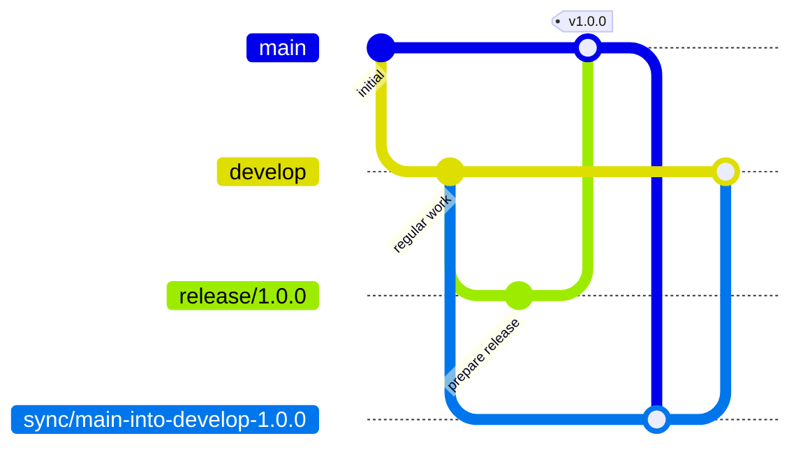

# Stability Flow

**Stability Flow** is a release-safe Git branching model for teams that need predictable releases, production hotfixes, and explicit reconciliation back into ongoing development.

It is designed as a practical alternative to Gitflow for teams that want:

- a protected production branch
- structured release preparation
- safer hotfix handling
- explicit production-to-development reconciliation
- optional CI and GitHub ruleset enforcement

Stability Flow is **spec-first**, but it is also **usable today** through reusable GitHub workflows, copy-pasteable workflow definitions, and optional GitHub rulesets.

## Pre-1.0 Notice

Stability Flow is currently being refined.

Until `v1.0.0`, some reusable workflows may reference `@main` while rules, validations, and rollout ergonomics are finalized.

Once stabilized, versioned tags will be the recommended integration path.

## Why Stability Flow?

Many teams sit in an awkward middle ground:

- **GitHub Flow** can feel too loose for release trains and hotfixes
- **Gitflow** can feel too heavy and ceremony-driven
- **Trunk-based development** is often ideal in theory, but not always practical for teams with staged releases and production divergence

Stability Flow exists for teams that need something **simpler than Gitflow**, but **safer and more explicit than ad hoc release branching**.

## Core Model

Stability Flow uses these branch roles:

- `main` → production / stable
- `develop` → ongoing integration
- `release/*` → release preparation and stabilization
- `hotfix/*` → urgent fixes from production
- `sync/*` → explicit reconciliation of production changes back into future development
- `wip/*` → optional isolated work branches

This creates a predictable path for both planned releases and emergency production fixes.

### Quick Visual



## Start Here

There are **three easy ways** to adopt Stability Flow.

### Option A — Use the full reusable workflow (recommended)

Use the included drop-in workflow to validate pull requests and branch activity.

### Option B — Copy and paste the workflow into your own repository

If you prefer to own the workflow directly, you can copy the provided workflow files into your repo and customize them.

### Option C — Roll out incrementally

Adopt only the parts you need first:

- `pr-to-main.yml`
- `pr-to-develop.yml`

Then later add:

- branch validation workflows
- GitHub rulesets
- helper branch-creation workflows

📘 See **[Getting Started](docs/getting-started.md)** for the full setup guide.

---

## Included Workflows

### Validation / enforcement

- `stability-flow.yml` → full drop-in validation workflow
- `pr-to-main.yml` → validates pull requests targeting `main`
- `pr-to-develop.yml` → validates pull requests targeting `develop`
- `release-branch.yml` → validates `release/*` branches
- `hotfix-branch.yml` → validates `hotfix/*` branches
- `sync-branch.yml` → validates `sync/*` branches
- `wip-branch.yml` → validates `wip/*` branches

### Helper / adoption workflows

- `create-release-branch.yml` → creates a correctly named `release/*` branch
- `create-hotfix-branch.yml` → creates a correctly named `hotfix/*` branch
- `create-sync-branch.yml` → creates a correctly named `sync/*` branch

These helper workflows are optional, but they make rollout easier and reduce naming mistakes.

---

## GitHub Rulesets Included

Stability Flow also includes optional GitHub branch/tag rulesets that teams can paste or adapt for their repositories:

- `main.ruleset.json`
- `develop.ruleset.json`
- `release.ruleset.json`
- `hotfix.ruleset.json`
- `sync.ruleset.json`
- `wip.ruleset.json`
- `tag.ruleset.json`

These are useful if you want branch protections and required checks to align directly with Stability Flow conventions.

📘 See **[Getting Started](docs/getting-started.md)** for recommended usage.

---

## Best Fit

Stability Flow works best for teams that:

- ship on a planned release cadence
- occasionally need production hotfixes
- want `main` to stay stable and tightly controlled
- want branching rules that can be enforced in GitHub Actions and rulesets

It is probably **not** the right fit if your team:

- does true trunk-based development
- deploys continuously many times per day
- has no meaningful distinction between “in development” and “production-ready”

---

## Documentation

The full public documentation lives under [`docs/`](docs/) and on the published documentation site.

Recommended reading order:

- [Getting Started](docs/getting-started.md)
- [Specification](docs/spec.md)
- [Conventions](docs/conventions.md)
- [Design](docs/design.md)
- [Release Flow](docs/release-flow.md)
- [Enforcement](docs/enforcement.md)

---

## Tooling

Stability Flow is a **specification first** project.

Tooling is optional.

This repository may include reference tooling and integrations to help teams adopt or validate the specification, such as:

- CLI validation
- CI integrations
- GitHub Actions
- reusable workflows

Tooling and implementation-specific docs live under:

- [Tools documentation](docs/tools/)

---

## Repository Structure

```text
.
├── docs/
│   ├── spec.md
│   ├── conventions.md
│   ├── design.md
│   ├── release-flow.md
│   ├── enforcement.md
│   └── tools/
├── docker/
├── scripts/
└── tools/
```

### Structure philosophy

- `docs/` contains **specification and public documentation**
- `docs/tools/` contains **tooling and implementation documentation**
- `tools/` contains **reference implementations**
- `scripts/` contains **local support and demo scripts**
- `docker/` contains **publishable container artifacts**

---

## Contributing

Contributions are welcome, especially around:

- specification clarity
- examples and diagrams
- enforcement patterns
- tooling and integrations

If you contribute, please try to preserve the distinction between:

- the **specification**
- the **reference tooling**

That separation is important to the project.

---

## License

MIT
