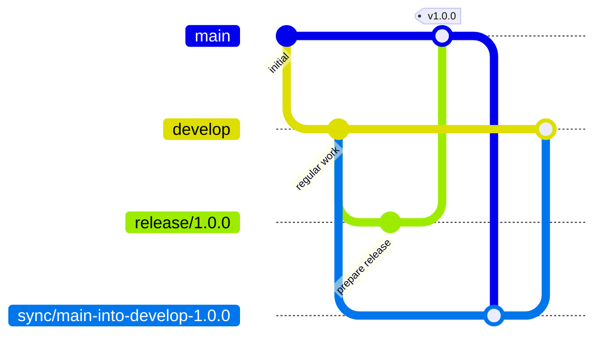

# Stability Flow

**Stability Flow** is a branching strategy specification for teams that want:

- a **stable production branch**
- **planned releases**
- **safe hotfixes**
- **explicit reconciliation after production divergence**

It is designed as an alternative to Gitflow for teams that want a workflow that is easier to reason about, easier to enforce, and clearer under release pressure.

---

## Why Stability Flow?

Many teams eventually run into the same operational problems:

- production needs to stay stable
- planned work continues in parallel
- urgent hotfixes sometimes need to ship before the next planned release
- `main` and the future development line can diverge temporarily
- branch movement becomes hard to reason about under pressure

Stability Flow exists to make those behaviors explicit.

It is designed to keep production promotion clear, hotfixes isolated, and reconciliation intentional.

---

## Core Idea

At a high level:

- regular work happens from `develop`
- production stays protected on `main`
- only `release/*` may promote into `main`
- hotfixes start from `main`
- production changes return to `develop` through `sync/*`

This keeps the path to production explicit and makes release behavior easier to reason about.

---

## Quick Visual



Planned work flows through `develop`, promotion happens through `release/*`, and production changes are reconciled back into the future development line through `sync/*`.

---

## What Stability Flow Optimizes For

Stability Flow is designed to optimize for:

- **production stability**
- **explicit release promotion**
- **safe hotfix handling**
- **clear reconciliation after divergence**
- **machine-checkable workflow rules**

It is especially useful for teams that:

- release on a planned cadence
- occasionally need urgent hotfixes
- want stronger protection around `main`
- want a branching model that can be validated by tooling and policy

---

## Documentation

The full public documentation lives under [`docs/`](docs/) and on the published documentation site.

Recommended reading order:

- [Specification](docs/spec.md)
- [Conventions](docs/conventions.md)
- [Design](docs/design.md)
- [Release Flow](docs/release-flow.md)
- [Enforcement](docs/enforcement.md)

---

## Tooling

Stability Flow is a **specification first** project.

Tooling is optional.

This repository may include reference tooling and integrations to help teams adopt or validate the specification, such as:

- CLI validation
- CI integrations
- GitHub Actions
- reusable workflows

Tooling and implementation-specific docs live under:

- [Tools documentation](docs/tools/)

---

## Repository Structure

```text
.
├── docs/
│   ├── spec.md
│   ├── conventions.md
│   ├── design.md
│   ├── release-flow.md
│   ├── enforcement.md
│   └── tools/
├── docker/
├── scripts/
└── tools/
```

### Structure philosophy

- `docs/` contains **specification and public documentation**
- `docs/tools/` contains **tooling and implementation documentation**
- `tools/` contains **reference implementations**
- `scripts/` contains **local support and demo scripts**
- `docker/` contains **publishable container artifacts**

---

## Contributing

Contributions are welcome, especially around:

- specification clarity
- examples and diagrams
- enforcement patterns
- tooling and integrations

If you contribute, please try to preserve the distinction between:

- the **specification**
- the **reference tooling**

That separation is important to the project.

---

## License

MIT
