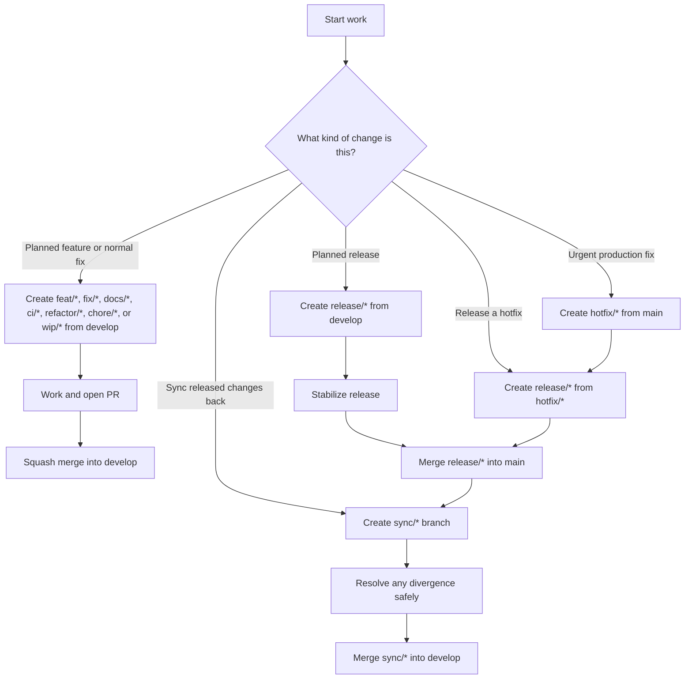

# Stability Flow

**Stability Flow** is a Git branching strategy for teams that need:

- a **stable production branch**
- **planned releases**
- **safe hotfixes**
- and **clear, enforceable branching rules**

It is designed as a practical alternative to **Gitflow**, with a stronger emphasis on:

- explicit hotfix reintegration
- a continuously stable `main`
- predictable release preparation
- validator-friendly rules that can be enforced locally or in automation

---

## Why Stability Flow?

Many teams adopt a branching strategy but still rely on **tribal knowledge** to answer questions like:

- Where should I branch from?
- Where should I merge to?
- What happens after a production hotfix?
- How do we avoid divergence between `main` and `develop`?
- How do we keep `main` stable while still preparing the next release?

Stability Flow solves that by making the rules **explicit** and **enforceable**.

### Core idea

> Keep `main` stable, keep `develop` moving, and make hotfix reintegration explicit instead of relying on memory.

---

# Core Branches

## `main`
The production-ready branch.

### Purpose
- reflects what is released or releasable
- must remain stable
- must only receive release-ready code

### Rules
- MUST remain stable
- MUST only receive merges from `release/*`
- MUST NOT receive direct feature or regular work merges

---

## `develop`
The integration branch for planned work.

### Purpose
- collects approved regular work
- is the source of planned releases
- is where the next version is prepared

### Rules
- regular work branches MUST branch from `develop`
- regular work branches MUST merge back into `develop`
- `release/*` branches for planned releases MUST be created from `develop`

---

# Supporting Branches

## Regular Work Branches

These are short-lived branches for day-to-day work.

### Allowed prefixes
- `feat/*`
- `fix/*`
- `docs/*`
- `ci/*`
- `refactor/*`
- `chore/*`
- `wip/*`

### Rules
- MUST branch from `develop`
- MUST merge only into `develop`
- MUST use **squash merge** into `develop`

### Notes
- `wip/*` is for temporary exploration only
- work started in `wip/*` SHOULD later be re-created through the correct route (`feat/*`, `fix/*`, `hotfix/*`, etc.)
- branch prefixes represent the **delivery lane**
- final squash commit types may be more expressive than the branch prefix (for example `chore/*` branch with `test:` squash commit)

---

## `release/*`

A release preparation branch.

### Purpose
Used to prepare a version for release.

Examples:
- `release/1.3.0`
- `release/1.2.4`

### Rules
- MUST be created from:
  - `develop`, or
  - `hotfix/*`
- MAY merge into:
  - `main`
- MAY be updated during stabilization
- MUST be the only branch type that merges into `main`

### Merge strategy
- merge into `main` SHOULD be **fast-forward only** where possible

---

## `hotfix/*`

An urgent production fix branch.

### Purpose
Used for urgent fixes that must go to production immediately.

Examples:
- `hotfix/1.2.4`
- `hotfix/2.0.1`

### Rules
- MUST branch from `main`
- MUST NOT branch from `develop`
- SHOULD be converted into a `release/*` before merging to `main`

### Why?
This keeps the production fix path explicit and ensures only `release/*` enters `main`.

---

## `sync/*`

A short-lived synchronization branch.

### Purpose
Used to safely bring released changes from `main` back into `develop`.

Examples:
- `sync/main-into-develop-1.2.4`
- `sync/post-hotfix-1.2.4`

### Rules
- SHOULD be used when syncing released production changes back into `develop`
- SHOULD be used after a hotfix release
- SHOULD be used instead of merging `main` directly into `develop`

### Why?
This creates a visible, reviewable synchronization step and makes hotfix reintegration a habit rather than an afterthought.

---

# Core Rules

## Branching Rules

- `main` MUST remain stable
- `develop` MUST be the source of planned work
- regular work branches MUST branch from `develop`
- regular work branches MUST squash merge into `develop`
- `hotfix/*` MUST branch from `main`
- `release/*` MUST be created from `develop` or `hotfix/*`
- only `release/*` MAY merge into `main`
- `sync/*` SHOULD be used to reintegrate released changes from `main` back into `develop`

---

## Commit Rules

Stability Flow supports conventional-style commit messages.

### Allowed final squash commit types
- `feat`
- `fix`
- `docs`
- `ci`
- `refactor`
- `chore`
- `test`
- `perf`
- `build`
- `style`

### Breaking changes
Breaking changes MAY be indicated by either:

- `!` in the type header, for example:
  - `feat!: remove legacy auth flow`

and/or

- a `BREAKING CHANGE:` footer, for example:

```text
feat!: remove legacy auth flow

BREAKING CHANGE: legacy auth flow has been removed
```

### Important

* `BREAKING CHANGE:` is **optional**
* `revert:` is allowed in **work branch history**
* `revert:` MUST NOT be used as the **final squash commit message**

---

# Normative Language

The following terms are used with their standard meaning:

* **MUST / MUST NOT** — mandatory requirement
* **SHOULD / SHOULD NOT** — recommended default, may be overridden with justified reason
* **MAY** — optional and permitted

---

# Visual Overview

## 1) High-level Git graph

```mermaid
gitGraph
   commit id: "main stable"
   branch develop
   checkout develop
   commit id: "develop baseline"

   branch feat/add-authentication
   checkout feat/add-authentication
   commit id: "work"
   commit id: "more work"
   checkout develop
   merge feat/add-authentication id: "squash"

   branch feat/improve-search
   checkout feat/improve-search
   commit id: "search work"
   checkout develop
   merge feat/improve-search id: "squash"

   branch release/1.3.0
   checkout release/1.3.0
   commit id: "release prep"
   commit id: "release fix"

   checkout main
   merge release/1.3.0 id: "release 1.3.0"

   branch hotfix/1.3.1
   checkout hotfix/1.3.1
   commit id: "urgent fix"

   branch release/1.3.1
   checkout release/1.3.1
   merge hotfix/1.3.1 id: "prepare hotfix release"

   checkout main
   merge release/1.3.1 id: "release 1.3.1"

   branch sync/main-into-develop-1.3.1
   checkout sync/main-into-develop-1.3.1
   merge main id: "sync released fix"

   checkout develop
   merge sync/main-into-develop-1.3.1 id: "sync back"
```

---

## 2) Branch decision flow



---

## 3) Hotfix divergence and sync example

This is one of the key problems Stability Flow is designed to solve.

### Scenario

* `develop` is ahead with planned work for `1.3.0`
* production needs an urgent hotfix `1.2.4`
* `main` receives the hotfix first
* now `main` and `develop` have diverged

### Safe answer

Use a `sync/*` branch to reintegrate the released production fix into `develop`.

```mermaid
gitGraph
   commit id: "1.2.3"
   branch develop
   checkout develop
   commit id: "feat A"
   commit id: "feat B"

   checkout main
   branch hotfix/1.2.4
   checkout hotfix/1.2.4
   commit id: "critical fix"

   branch release/1.2.4
   checkout release/1.2.4
   merge hotfix/1.2.4 id: "prepare hotfix"

   checkout main
   merge release/1.2.4 id: "release 1.2.4"

   branch sync/main-into-develop-1.2.4
   checkout sync/main-into-develop-1.2.4
   merge main id: "bring hotfix into sync branch"

   checkout develop
   merge sync/main-into-develop-1.2.4 id: "resolve divergence safely"
```

### Why this matters

Without an explicit sync step, teams often:

* forget to reintegrate the hotfix
* create hidden divergence
* hit confusing conflicts later during the next planned release

Stability Flow makes that synchronization explicit and reviewable.

---

# Validator

Stability Flow includes a validator CLI that checks whether branches, merges, origins, and commit messages comply with the flow.

## Supported validators

* `validate-branch-name`
* `validate-origin`
* `validate-merge`
* `validate-commit`

---

## Validate branch names

```bash
go run . validate-branch-name --branch feat/add-authentication
go run . validate-branch-name --branch release/1.3.0
go run . validate-branch-name --branch banana/foo
```

---

## Validate branch origin

```bash
go run . validate-origin --branch hotfix/1.2.4 --base main
go run . validate-origin --branch release/1.3.0 --base develop
go run . validate-origin --branch feat/add-authentication --base main
```

---

## Validate merge eligibility

```bash
go run . validate-merge --source feat/add-authentication --target develop
go run . validate-merge --source release/1.3.0 --target main
go run . validate-merge --source feat/add-authentication --target main
```

---

## Validate commit messages

### Work branch validation

```bash
go run . validate-commit --mode work --message "revert: undo previous change"
```

### Final squash validation

```bash
go run . validate-commit --mode squash --message "feat: add authentication"
go run . validate-commit --mode squash --message "feat!: remove legacy auth flow"
```

### Breaking change footer example

```bash
go run . validate-commit \
  --mode squash \
  --message $'feat!: remove legacy auth flow\n\nBREAKING CHANGE: legacy auth flow removed'
```

---

# Output Formats

The validator supports multiple output formats.

## Text (default)

```bash
go run . validate-merge --source release/1.3.0 --target main
```

Example output:

```text
PASS: merge allowed: release/1.3.0 -> main
reason: only release/* may merge into main, using fast-forward only
```

---

## JSON

```bash
go run . validate-origin --branch hotfix/1.2.4 --base main --format json
```

Example output:

```json
{
  "ok": true,
  "command": "validate-origin",
  "reason": "hotfix/* must be created from main",
  "fields": {
    "base": "main",
    "branch": "hotfix/1.2.4"
  }
}
```

---

## JSONL

```bash
go run . validate-branch-name --branch feat/add-authentication --format jsonl
```

Example output:

```json
{"ok":true,"command":"validate-branch-name","reason":"valid branch type: feat","fields":{"branch":"feat/add-authentication"}}
```

---

## Markdown

```bash
go run . validate-merge --source release/1.3.0 --target main --format markdown
```

Example output:

```md
## Stability Flow Validation Result

- **Command:** `validate-merge`
- **Status:** ✅ Passed
- **Source:** `release/1.3.0`
- **Target:** `main`
- **Reason:** only release/* may merge into main, using fast-forward only
```

---

# When Stability Flow is a good fit

Stability Flow is a strong fit for teams that:

* ship on **planned release cycles**
* need a **stable production branch**
* want a cleaner hotfix path than ad hoc Gitflow usage
* want a branching strategy that can be **validated automatically**

It is especially useful where:

* production hotfixes happen occasionally
* `develop` often contains work not yet ready for release
* release preparation and hotfix handling need to stay explicit

---

# When Stability Flow may not be the best fit

Stability Flow may be unnecessary if your team:

* ships directly from trunk/main continuously
* does not use release branches
* does not need a separate integration branch
* prefers a very minimal trunk-based workflow

It is intentionally more structured than trunk-based development.

---

# Philosophy

Stability Flow is based on a simple principle:

> Branching rules should not depend on memory, habit, or guesswork.

If a team has a branching strategy, it should be:

* understandable
* teachable
* visual
* enforceable

That is what Stability Flow is designed to provide.
