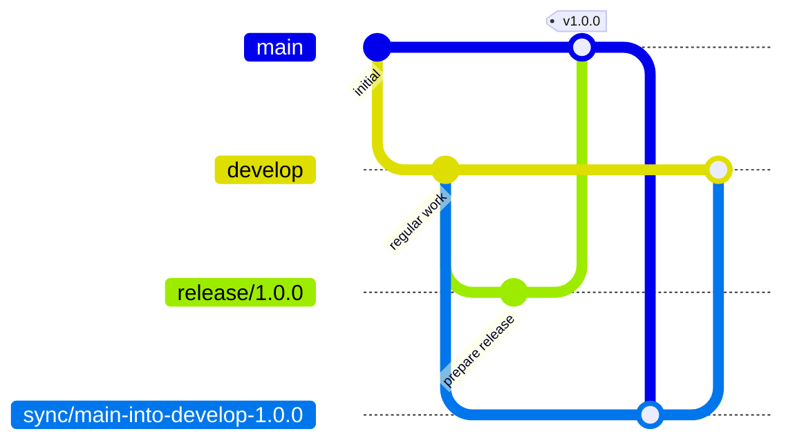

# Stability Flow

**Stability Flow** is a branching strategy specification for teams that want:

- a **stable production branch**
- **planned releases**
- **safe hotfixes**
- **explicit reintegration after production divergence**

It is designed as an alternative to Gitflow for teams that want a workflow that is easier to reason about, easier to enforce, and clearer under release pressure.

---

## Core Idea

Stability Flow keeps production promotion explicit.

At a high level:

- regular work happens from `develop`
- production stays protected on `main`
- only `release/*` may promote into `main`
- hotfixes start from `main`
- production changes return to `develop` through `sync/*`

This keeps the path to production clearer and makes hotfix and reconciliation behavior more predictable.

---

## Quick Visual

Planned work flows through `develop`, promotion happens through `release/*`, and production changes are reconciled back into the future development line through `sync/*`.

---

## Why Use Stability Flow?

Stability Flow is useful when your team needs to balance:

- **ongoing development**
- **planned releases**
- **urgent production hotfixes**
- **clear promotion boundaries**

It is especially useful if you want:

- stronger protection around `main`
- explicit release promotion
- safer handling of production divergence
- a workflow that can be validated by policy and tooling

---

## Key Principles

### Stable Production

`main` represents the stable production line.

### Explicit Promotion

Only `release/*` branches promote into `main`.

### Safe Hotfixes

Hotfixes start from `main`, not from ongoing development.

### Required Reintegration

Production changes return to `develop` through `sync/*` after release.

### Enforceable Structure

Branch roles and promotion paths are intentionally designed to be clear and machine-checkable.

---

## Documentation

### Specification

Start here for the normative branching model:

- [Specification](spec.md)

### Conventions

Read this for branch naming and commit conventions:

- [Conventions](conventions.md)

### Design

Read this for the rationale, design goals, and tradeoffs:

- [Design](design.md)

### Release Examples

Read this for worked examples and git graphs:

- [Release Flow](release-flow.md)

### Enforcement

Read this for validation surfaces and enforcement guidance:

- [Enforcement](enforcement.md)

---

## Tooling

Stability Flow is a specification first.

Tooling is optional.

Reference tooling may exist to help teams adopt or validate the model, but tooling is not the definition of the model.

If present, tooling and implementation-specific documentation live under:

- [Tools](tools/cli-validator.md)

---

## Summary

Stability Flow is built around a simple idea:

> keep production safe, make promotion explicit, and treat reintegration as a first-class part of the workflow.

If that matches the shape of workflow your team needs, start with the specification.
