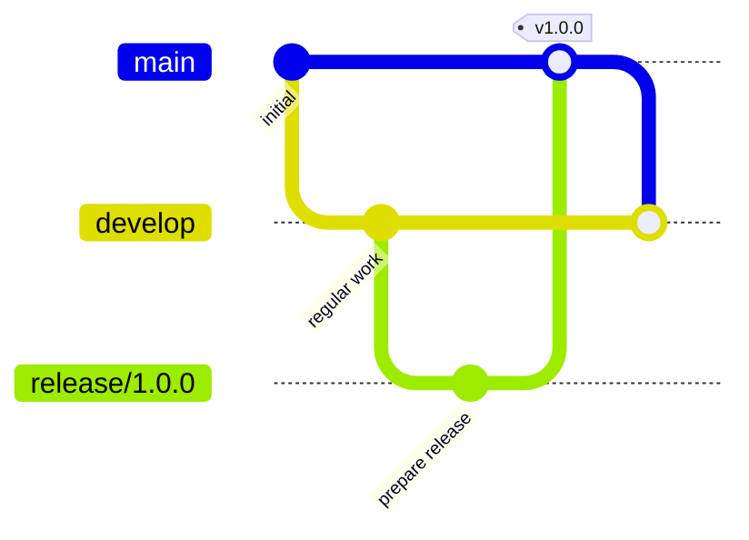

# Stability Flow

**Stability Flow** is a branching strategy specification for teams that want:

- a **stable production branch**
- **planned releases**
- **safe hotfixes**
- **explicit reintegration after production divergence**

It is designed as an alternative to Gitflow for teams that want a workflow that is easier to reason about, easier to enforce, and clearer under release pressure.

---

## Core Idea

Stability Flow keeps production promotion explicit.

At a high level:

- regular work happens from `develop`
- production stays protected on `main`
- only `release/*` may promote into `main`
- hotfixes start from `main`
- production changes must come back into `develop`

This makes the path to production clearer and keeps hotfix behavior predictable.

---

## Quick Visual

Planned work flows through `develop`, promotion happens through `release/*`, and production changes are brought back into the development line.

---

## Why Use Stability Flow?

Stability Flow is useful when your team needs to balance:

* **ongoing development**
* **planned releases**
* **urgent production hotfixes**
* **clear promotion boundaries**

It is especially helpful if you want:

* stronger protection around `main`
* explicit release promotion
* safer handling of production divergence
* a workflow that can be validated by policy and tooling

---

## Key Principles

### Stable Production

`main` represents the stable production line.

### Explicit Promotion

Only `release/*` branches promote into `main`.

### Safe Hotfixes

Hotfixes start from `main`, not from ongoing development.

### Required Reintegration

Production changes must come back into `develop` after release.

### Enforceable Structure

Branch roles and promotion paths are intentionally designed to be clear and machine-checkable.

---

## Read the Docs

### Specification

Start here if you want the full standard:

* [Specification](spec.md)

### Design

Read this if you want the rationale and tradeoffs:

* [Design](design.md)

### Release Examples

Read this if you want worked examples and git graphs:

* [Release Flow](release-flow.md)

### Enforcement

Read this if you want to understand how Stability Flow can be enforced:

* [Enforcement](enforcement.md)

---

## Tooling

Stability Flow is a specification first.

Tooling is optional.

This project may include reference tooling and integrations to help teams adopt or enforce the specification, including validators and CI/CD integrations.

Tooling and implementation docs live under:

* [Tools](tools/cli-validator.md)

---

## Summary

Stability Flow is built around a simple idea:

> keep production safe, make promotion explicit, and treat reintegration as a first-class part of the workflow.

If that is the shape of workflow your team needs, start with the specification.
