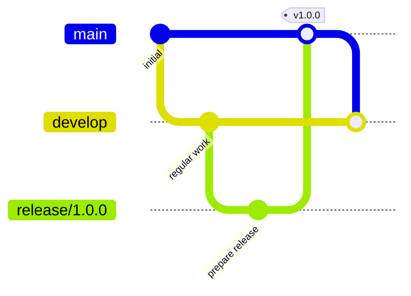
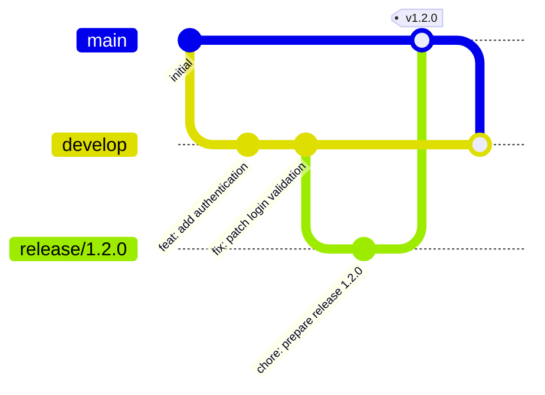
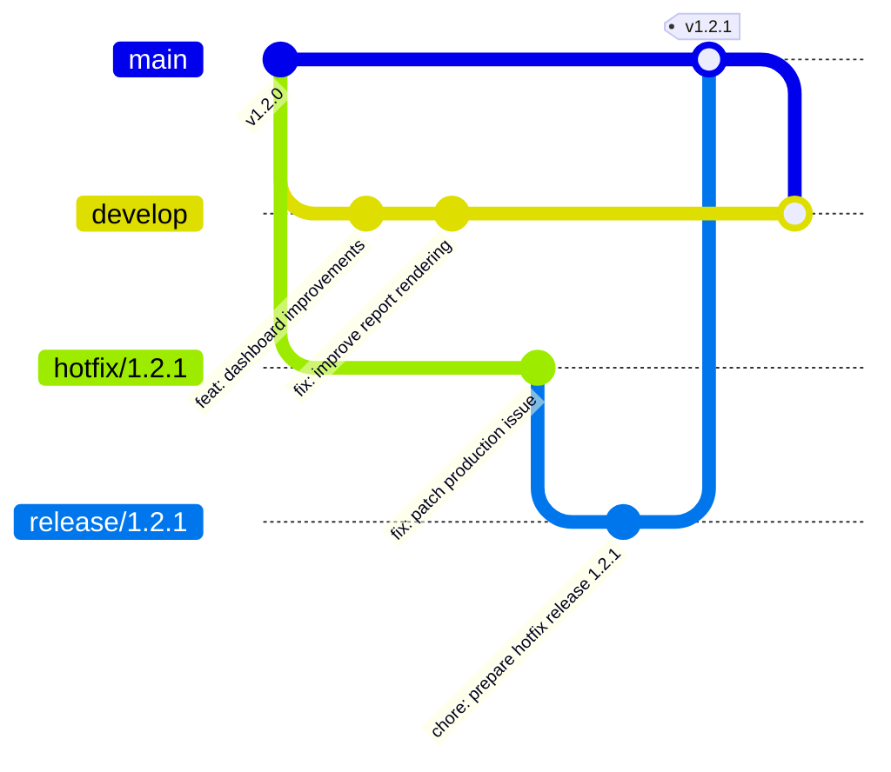
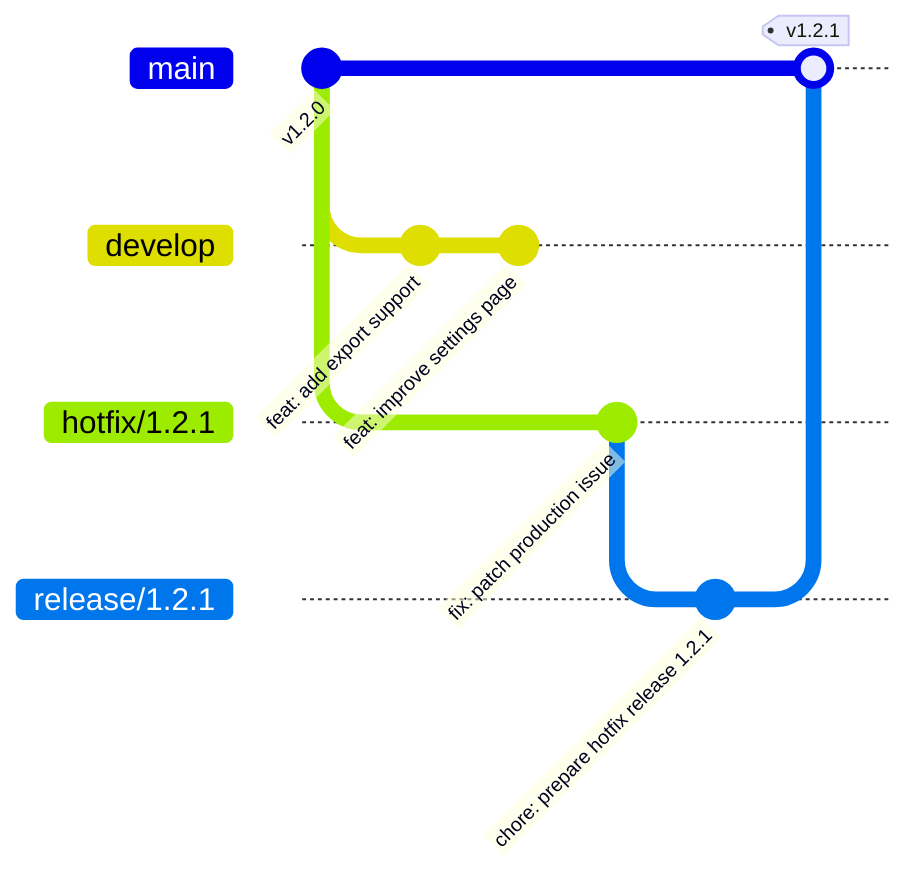
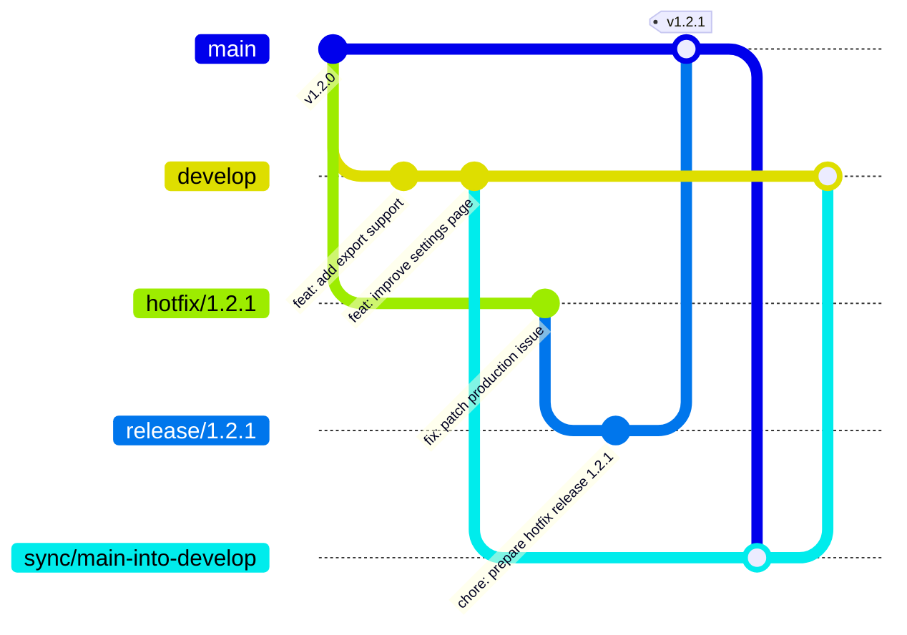
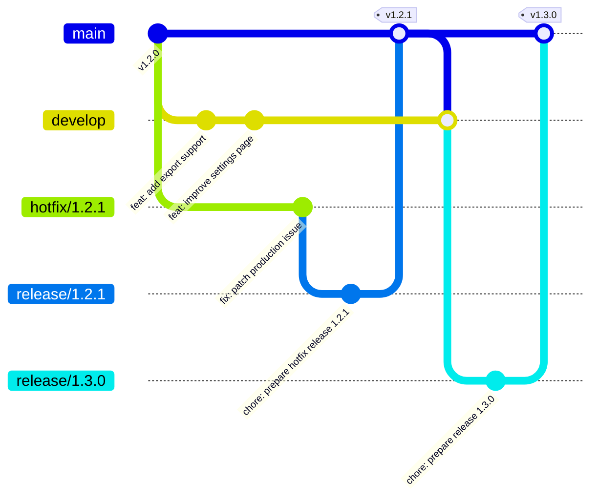
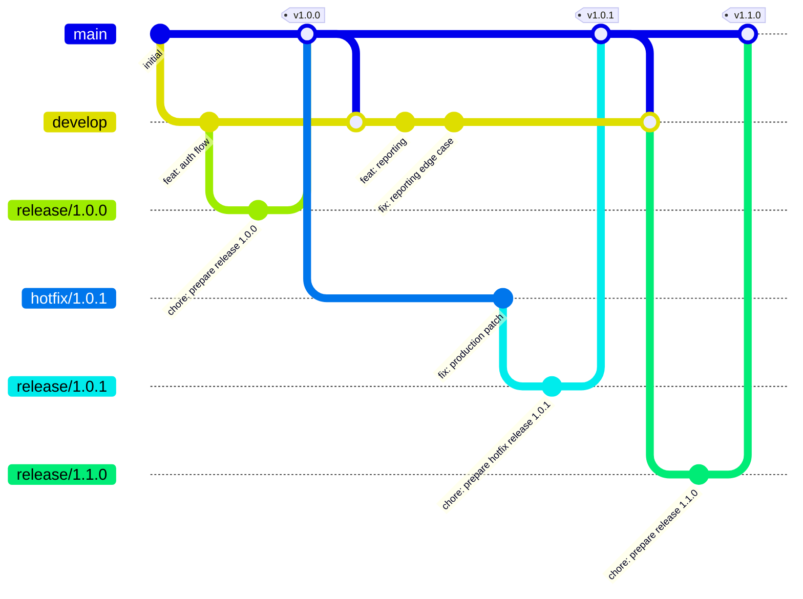

# Release Flow

## 1. Overview

This document provides worked examples of the Stability Flow branching model.

It is intended to show how the flow behaves in practice, especially in scenarios involving:

- planned releases
- urgent hotfixes
- temporary divergence between `main` and `develop`
- explicit reintegration back into the development line

For normative rules, see the specification.

---

## 2. Core Shape

At a high level, Stability Flow looks like this:

The important idea is:

* regular work accumulates on `develop`
* promotion happens through `release/*`
* `main` stays stable
* production changes return to `develop`

---

## 3. Planned Release Example

A planned release begins from `develop`.

### Step-by-step

1. regular work is integrated into `develop`
2. a `release/*` branch is created from `develop`
3. release preparation happens on `release/*`
4. the release is promoted into `main`
5. `main` is reintegrated into `develop`

---

### Example

### What happened

* `develop` received normal integrated work
* `release/1.2.0` was created as the production promotion branch
* `main` received the release
* `develop` received the production state back

This keeps the promotion path explicit.

---

## 4. Hotfix Release Example

A hotfix begins from `main`, not `develop`.

This is one of the most important behaviors in Stability Flow.

### Step-by-step

1. a `hotfix/*` branch is created from `main`
2. the urgent production fix is implemented there
3. a `release/*` branch is created from the hotfix
4. the release is promoted into `main`
5. `main` is reintegrated into `develop`

---

### Example

### What happened

* `develop` had unreleased work in progress
* production needed an urgent fix
* the hotfix was isolated from unreleased work
* the hotfix still followed the same promotion rule:

  * only `release/*` promoted into `main`
* the production fix was then brought back into `develop`

This is a core Stability Flow use case.

---

## 5. Divergence Is Normal

A key idea in Stability Flow is that divergence between `main` and `develop` is expected.

It often looks like this:

* `develop` is ahead with planned work
* `main` receives a hotfix release
* the branches diverge temporarily
* reintegration resolves the divergence

This is not a workflow failure.

It is a normal release-management scenario.

---

## 6. Divergence Example

At this point:

* `main` contains the hotfix release
* `develop` contains future planned work
* they have diverged

This is expected.

The next required step is reintegration.

---

## 7. Reintegration Example

After the hotfix release, `main` must be brought back into `develop`.

### Direct reintegration

This is valid and simple.

---

## 8. Reintegration Through `sync/*`

Some teams prefer reintegration to be explicit and reviewable.

That is where `sync/*` is useful.

### Example

### Why use `sync/*`

A `sync/*` branch is useful when teams want:

* explicit reintegration review
* a dedicated place to resolve conflicts
* repeatable operational muscle memory
* a visible reconciliation step after hotfixes

It is not required, but it is often helpful.

---

## 9. Planned Release After a Hotfix

A very common source of confusion is what happens next when:

* a hotfix has already shipped
* `develop` was already ahead
* the planned release still needs to happen

The answer is:

> the next planned release simply continues from the updated `develop` branch after reintegration.

---

### Example

After `v1.2.1` hotfix release and reintegration:

### What this means

The planned release `1.3.0` now contains:

* the previously unreleased planned work from `develop`
* the hotfix that already shipped in `1.2.1`

That is correct and expected.

The hotfix does not get “lost”.
It becomes part of the next planned release line after reintegration.

---

## 10. Longer-Lived Example

After a few releases and hotfixes, the history may look like this:

### Key observation

Even after several releases and hotfixes:

* `main` remains the stable production line
* `develop` remains the next planned release line
* hotfixes stay isolated
* production changes return to development cleanly

That is the intended long-term behavior.

---

## 11. Recommended Team Muscle Memory

A healthy Stability Flow habit looks like this:

### Regular work

* branch from `develop`
* squash merge back into `develop`

### Planned release

* create `release/*` from `develop`
* promote to `main`
* reintegrate to `develop`

### Hotfix

* branch from `main`
* create `release/*` from the hotfix
* promote to `main`
* reintegrate to `develop`

### Optional reintegration review

* use `sync/*` if explicit review is helpful

This is the operational rhythm the model is designed to support.

---

## 12. Summary

The most important thing to understand about Stability Flow is this:

> divergence is expected, promotion is explicit, and reintegration is required.

That leads to a workflow where:

* planned work stays on `develop`
* production stays protected on `main`
* releases move through `release/*`
* hotfixes start from `main`
* production changes come back into `develop`

That is the practical shape of the flow.
