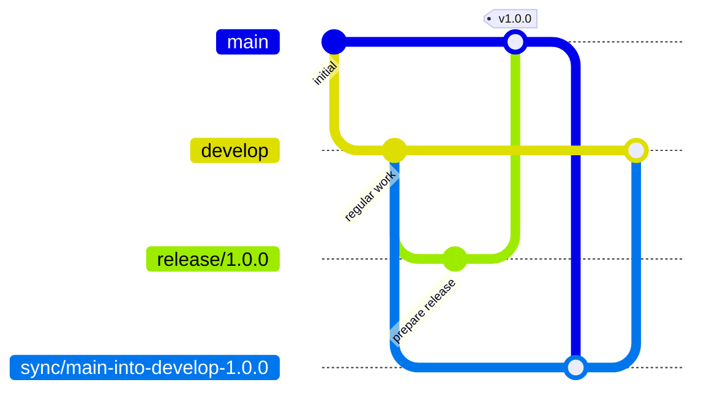
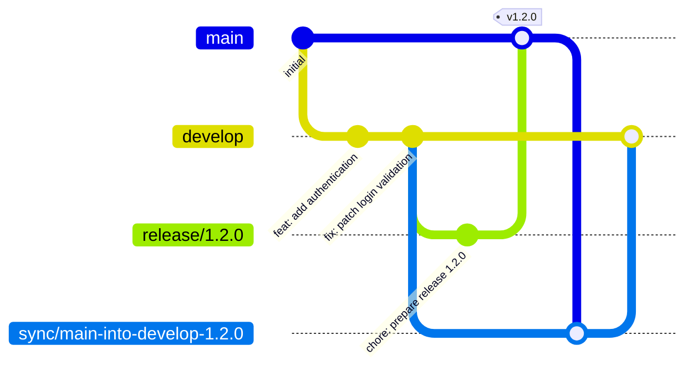
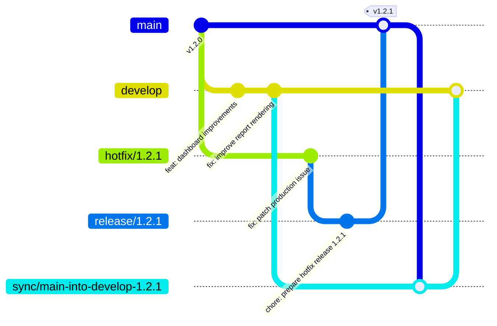
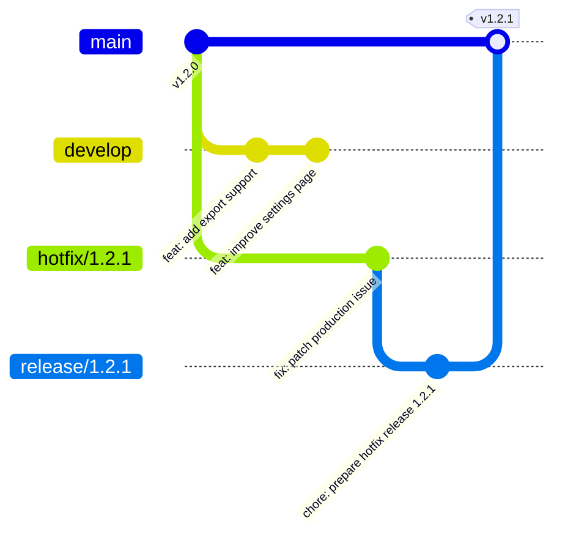
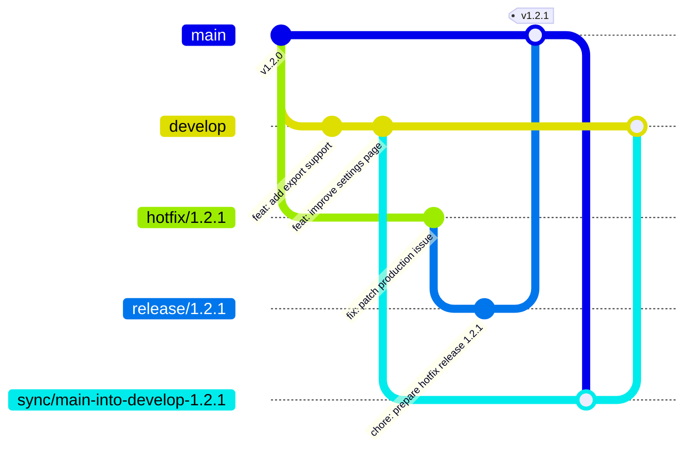
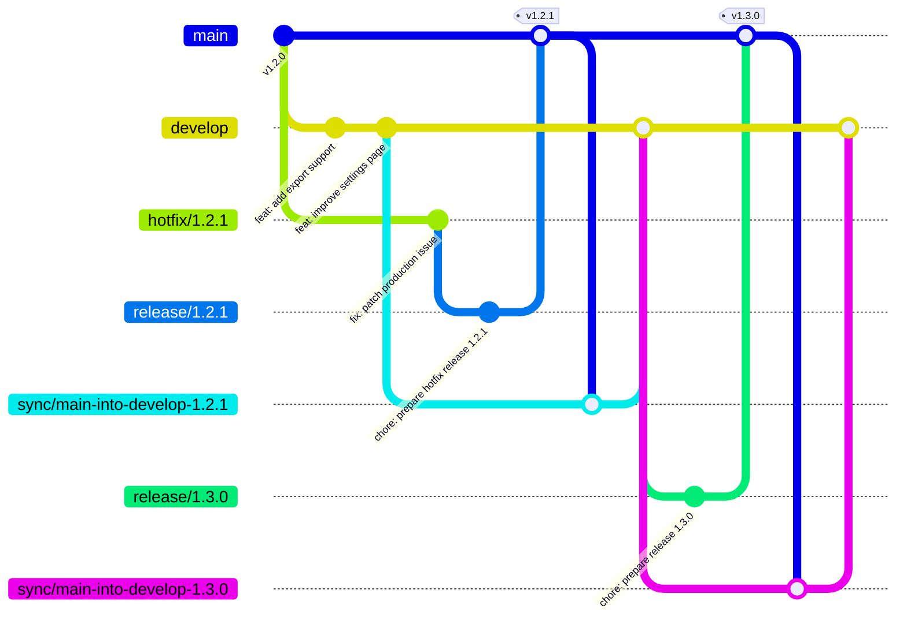
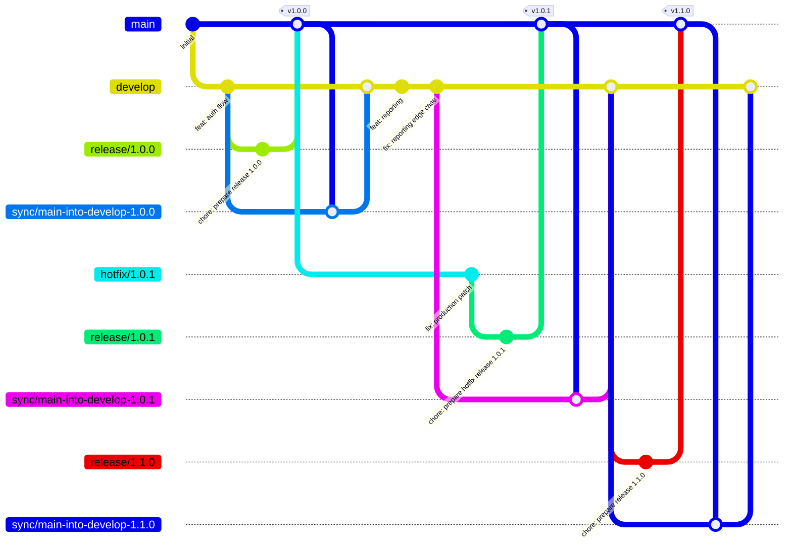

# Stability Flow Release Flow

## 1. Purpose

This document provides worked examples of how **Stability Flow** behaves in practice.

It is intended to show the operational shape of the model, especially in scenarios involving:

- planned releases
- urgent hotfixes
- temporary divergence between production and planned work
- reconciliation back into the future development line

This document is explanatory and example-driven.

It does **not** define the normative rules of the specification.

For the branching model itself, see:

- [Specification](spec.md)

---

## 2. Core Shape

At a high level, Stability Flow follows this shape:



The important idea is:

- planned work accumulates on `develop`
- promotion happens through `release/*`
- `main` remains the production line
- production changes return to `develop` through `sync/*`

---

## 3. Planned Release Example

A planned release starts from the current development line.

### Operational shape

```text
develop → release/X.Y.Z → main → sync/main-into-develop-X.Y.Z → develop
```

### Example



### What happened

- planned work was integrated into `develop`
- a release branch was created to prepare promotion
- the release was promoted into `main`
- production truth was then reconciled back into `develop`

This is the normal planned release rhythm in Stability Flow.

---

## 4. Promotion Detail

One of the most important Stability Flow mechanics is how a release reaches production.

The operational shape is:

1. create `release/*` from `develop`
2. prepare the release
3. rebase the release branch onto the latest `main`
4. fast-forward promote into `main`

### Why this matters operationally

This keeps production promotion:

- explicit
- linear
- easier to audit
- based on the current production line

This becomes especially important if production has changed since the release branch was created.

---

## 5. Hotfix Release Example

A hotfix starts from production, not from planned work.

This is one of the most important Stability Flow behaviors.

### 5.1. Operational Shape

```text
main → hotfix/X.Y.Z → release/X.Y.Z → main → sync/main-into-develop-X.Y.Z → develop
```

### 5.2. Example



### 5.3. What happened

- `develop` already contained future planned work
- production needed an urgent fix
- the hotfix was isolated from unreleased work
- the hotfix still used the same promotion path as every other production change
- the production fix was then reconciled back into future development

This is a core Stability Flow use case.

---

## 6. Divergence Is Normal

A key part of Stability Flow is recognizing that production and planned development will sometimes diverge.

A common example looks like this:

- `develop` is ahead with planned work
- `main` receives a hotfix release
- the branches temporarily represent different realities

This is expected behavior.

It is not a workflow failure.

The model is designed to make that divergence understandable and recoverable.

---

## 7. Divergence Example



At this point:

- `main` contains the hotfix release
- `develop` contains future planned work
- the branches have diverged

This is the normal point where reconciliation becomes necessary.

---

## 8. Reconciliation Through `sync/*`

After a release or hotfix, production changes return to future development through a dedicated reconciliation branch.

### 8.1. Example



### Why the sync branch matters in practice

A dedicated `sync/*` branch gives teams a clear place to:

- merge production truth back into planned work
- resolve conflicts
- review the reconciliation
- preserve the meaning of what happened

This makes reintegration visible rather than implicit.

---

## 9. Planned Release After a Hotfix

A common source of confusion is what happens next after a hotfix has already shipped while planned work was still in progress.

The answer is:

> the next planned release continues from the updated `develop` branch after reconciliation.

### 9.1. Example



### What this means

The planned release `1.3.0` now contains:

- the previously unreleased planned work from `develop`
- the production fix that already shipped in `1.2.1`

That is correct and expected.

The hotfix is not lost.

It becomes part of the next planned release line after reconciliation.

---

## 10. Longer-Lived Example

Over time, a repository using Stability Flow may contain several planned releases and hotfixes.

A longer history might look like this:



### What stays true over time

Even as history grows:

- `main` remains the production line
- `develop` remains the future release line
- hotfixes stay isolated from unreleased work
- production changes return through explicit reconciliation

That is the intended long-term behavior of the model.

---

## 11. Operational Muscle Memory

Teams using Stability Flow usually benefit from developing a few simple habits.

### Regular work

- branch from `develop`
- integrate back into `develop`

### Planned release

- create `release/*` from `develop`
- prepare the release
- rebase onto the latest `main`
- promote into `main`
- reconcile back through `sync/*`

### Hotfix

- branch from `main`
- isolate the production fix
- promote through `release/*`
- reconcile back through `sync/*`

### Reconciliation

- create `sync/*` from `develop`
- merge `main` into the sync branch
- resolve conflicts if needed
- merge the sync branch back into `develop`

These habits make the model easier to use consistently.

---

## 12. Summary

The most important thing to understand about Stability Flow in practice is this:

> planned work continues, production stays protected, and reconciliation is treated as a real part of the workflow.

That leads to a branching rhythm where:

- planned work stays on `develop`
- production promotion happens through `release/*`
- hotfixes start from `main`
- divergence is expected
- production truth returns to future development through `sync/*`

That is the practical shape of Stability Flow.
